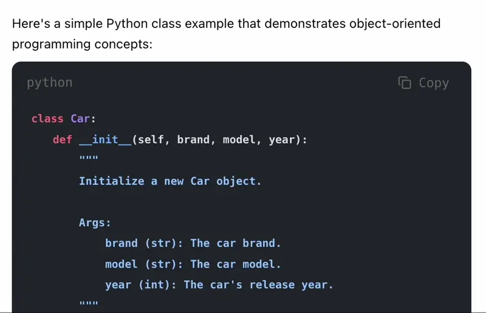

# shiki-header-with-copy

A Shiki transformer that adds a header with language display and a copy button to syntax-highlighted code blocks.

## Features

- ⚙️ Customizable header with language name display
- 📋 One-click copy functionality with visual feedback
- 🎨 Style it with CSS or Tailwind CSS classes
- 📦 ESM module support

## Demo




## Installation

```bash
npm install shiki-header-with-copy
```

## Usage

### Basic Usage

```typescript
import { getHighlighter } from 'shiki'
import { addHeaderWithCopy } from 'shiki-header-with-copy'

const highlighter = await getHighlighter({
  theme: 'github-dark',
  transformers: [
    addHeaderWithCopy()
  ]
})
```

### Style it with Tailwind CSS

```typescript
import { getHighlighter } from 'shiki'
import { addHeaderWithCopy } from 'shiki-header-with-copy'

const highlighter = await getHighlighter({
  theme: 'github-dark',
  transformers: [
    addHeaderWithCopy({
        headerClass: 'flex justify-between items-center px-4 pt-3 text-muted-foreground',
        preClass: 'overflow-x-hidden rounded-lg my-2',
        codeWrapperClass: 'px-4 py-4 overflow-x-auto',
        showButtonText: true,
        copyButtonClass: 'hover:text-accent px-2 group **:data-svg:h-[15px] *:flex *:items-center *:gap-2',
        copyReadyIconClass: '',
        copySuccessIconClass: '**:data-svg:text-green-500',
        langClass: 'text-sm',
    })
  ]
})
```

## Or style with your custom CSS

```css
pre:has(code) {
  border-radius: 10px;
  margin: 15px 0;
  position: relative;
  overflow-x: hidden;
}

pre:has(code) .shiki-header-with-copy {
  display: flex;
  justify-content: space-between;
  align-items: center;
  padding: 8px 12px;
}

pre:has(code) .code-wrapper {
  overflow-x: auto;
  padding: 16px;
}

pre:has(code) .shiki-header-with-copy button {
  padding: 0 8px;
}

pre:has(code) .shiki-header-with-copy button:hover {
  color: #0969da;
}

pre:has(code) .shiki-header-with-copy button span {
  display: flex;
  align-items: center;
  gap: 4px;
}

pre:has(code) .shiki-header-with-copy button svg {
  height: 15px;
}

pre:has(code) .shiki-header-with-copy button span.success {
  color: #009900;
}
```

## Options

| Option | Type | Placed after class | Description |
|--------|------|---------|-------------|
| `headerClass` | `string` | `'shiki-header-with-copy'` | CSS class for the header container |
| `langClass` | `string` | `'lang'` | CSS class for the language text |
| `copyButtonClass` | `string` | `'copy'` | CSS class for the copy button |
| `copyReadyIconClass` | `string` | `'ready'` | CSS class for the copy icon |
| `copySuccessIconClass` | `string` | `'success'` | CSS class for the success icon |
| `preClass` | `string` | `'shiki'` | CSS class for the pre element |
| `codeWrapperClass` | `string` | `'code-wrapper'` | CSS class for the code wrapper |
| `showButtonText` | `boolean` | `false` | Whether to show text labels on the copy button |

## Generated HTML Structure

The transformer generates the following HTML structure:

```html
<div>
  <!-- ... -->
  <pre class="shiki shiki-themes [...preClass]">
    <div class="shiki-header-with-copy [...headerClass]">
      <span class="lang [...langClass]"><!-- language from fenced code block --></span>
      <button class="copy [...copyButtonClass]" onclick="...">
        <span class="ready [...copyReadyIconClass]">
          <svg><!-- Copy icon SVG --></svg>
          <span>Copy</span> <!-- Shown only if showButtonText is true -->
        </span>
        <span class="success [...copySuccessIconClass]" style="display: none">
          <svg><!-- Checkmark icon SVG --></svg>
          <span>Copied</span> <!-- Shown only if showButtonText is true -->
        </span>
      </button>
    </div>
    <div class="code-wrapper">
        <code><!-- Shiki highlighted code --></code>
    </div>
  </pre>
  <!-- ... -->
</div>
```

## API Reference

### `addHeaderWithCopy(options?: HeaderOptions): ShikiTransformer`

Creates a Shiki transformer that adds a header with copy functionality.

#### `HeaderOptions`

```typescript
interface HeaderOptions {
  headerClass?: string
  langClass?: string
  copyButtonClass?: string
  copyReadyIconClass?: string
  copySuccessIconClass?: string
  preClass?: string
  codeWrapperClass?: string
  contentClass?: string
  showButtonText?: boolean
}
```

## Development

```bash
# Install dependencies
npm install

# Build the project
npm run build

# Watch for changes
npm run dev

# Clean build artifacts
npm run clean
```

## Contributing

PRs and feature requests welcome!

## License

MIT
